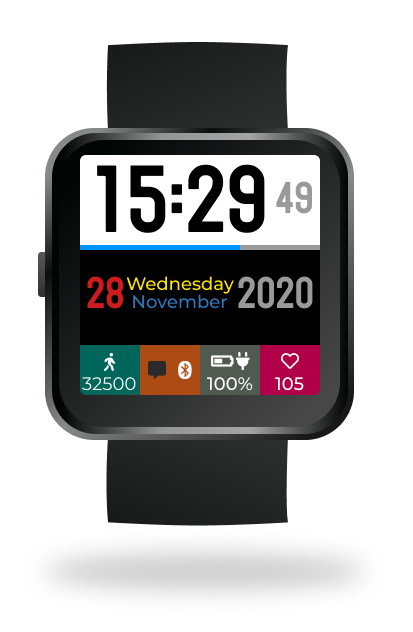

# PineTime

> The PineTime is a free and open source smartwatch capable of running custom-built open operating systems. Some of the notable features include a heart rate monitor, a week-long battery as well as a capacitive touch IPS display that is legible in direct sunlight. It is a fully community driven side-project, which means that it will ultimately be up to the developers and end-users to determine when they deem the PineTime ready to ship.

> We envision the PineTime as a companion for not only your PinePhone but also for your favorite devices — any phone, tablet, or even PC.

*https://www.pine64.org/pinetime/*

The **Pinetime** smartwatch is built around the NRF52832 MCU (512KB Flash, 64KB RAM), a 240*240 LCD display driven by the ST7789 controller, an accelerometer, a heart rate sensor, and a vibration motor.

# Infinitime joaquimorg Fork

# InfiniTime

The goal of this project is to design an open-source firmware for the Pinetime smartwatch : 

 - Code written in **modern C++**;
 - Build system based on **CMake**;
 - Based on **[FreeRTOS 10.0.0](https://freertos.org)** real-time OS.
 - Using **[LittleVGL/LVGL 7](https://github.com/joaquimorg/lvgl)** as UI library...
 - ... and **[NimBLE 1.3.0](https://github.com/apache/mynewt-nimble)** as BLE stack.

## Overview

As of now, here is the list of achievements of this project:

 - Fast and optimized LCD driver
 - BLE communication
 - Rich user interface via display, touchscreen and pushbutton
 - Time synchronization via BLE
 - Notification via BLE
 - Multiple 'apps' : 
    * Clock (displays the date, time, battery level, BLE connection status, heart rate and step count)
    * Heart rate
    * Motion
    * System info (displays various info : BLE MAC, build date/time, uptime, version, ...)
    * Brightness (allows the user to configure the brightness of the display)
 - Supported by this companion app (development is in progress):
    * [Gadgetbridge](https://codeberg.org/joaquimorg/Gadgetbridge) (on Android)
    
 - **[Experimental]** OTA (Over-the-air) update via BLE
 - **[Experimental]** Bootloader based on [MCUBoot](https://juullabs-oss.github.io/mcuboot/)
 
## Documentation

### Getting started
 - [Flash, upgrade (OTA), time synchronization,...](doc/gettingStarted/gettingStarted.md)

### Develop
 - [Generate the fonts and symbols](src/displayapp/fonts/Readme.md)

### Build, flash and debug
 - [Project branches](doc/branches.md)
 - [Versioning](doc/versioning.md)
 - [Files included in the release notes](doc/filesInReleaseNotes.md)
 - [Build the project](doc/buildAndProgram.md)
 - [Flash the firmware using OpenOCD and STLinkV2](doc/openOCD.md)
 - [Build the project with Docker](doc/buildWithDocker.md)
 - [Bootloader, OTA and DFU](./bootloader/README.md)
 - [Stub using NRF52-DK](./doc/PinetimeStubWithNrf52DK.md)
 - Logging with JLink RTT.
 - Using files from the releases

### Contribute
 - [How to contribute ?](doc/contribute.md)

### API
 - [BLE implementation and API](./doc/ble.md)
 
### Architecture and technical topics
 - [Memory analysis](./doc/MemoryAnalysis.md)
 
### Using the firmware
 - [Integration with Gadgetbridge](doc/companionapps/Gadgetbridge.md)
 - [Integration with AmazFish](doc/companionapps/Amazfish.md)
 - [Firmware update, OTA](doc/companionapps/NrfconnectOTA.md)
 
    
## TODO - contribute

This project is far from being finished, and there are still a lot of things to do for this project to become a firmware usable by the general public.

Here a quick list out of my head of things to do for this project:

 - Improve BLE communication stability and reliability
 - Improve OTA and MCUBoot bootloader
 - Add more functionalities : Alarm, chronometer, configuration, activities, heart rate logging, games,...
 - Add more BLE functionalities : call notifications, agenda, configuration, data logging,...
 - Measure power consumption and improve battery life
 - Improve documentation, take better pictures and video than mine
 - Improve the UI
 - Create companion app for multiple OSes (Linux, Android, iOS) and platforms (desktop, ARM, mobile). Do not forget the other devices from Pine64 like [the Pinephone](https://www.pine64.org/pinephone/) and the [Pinebook Pro](https://www.pine64.org/pinebook-pro/). 
 - Design a simple CI (preferably self-hosted and easy to reproduce).
 
Do not hesitate to clone/fork the code, hack it and create pull-requests. I'll do my best to review and merge them :)

## Licenses
This project is released under the GNU General Public License version 3 or, at your option, any later version.

It integrates the following projects:
 - RTOS : **[FreeRTOS](https://freertos.org)** under the MIT license
 - UI : **[LittleVGL/LVGL](https://lvgl.io/)** under the MIT license
 - BLE stack : **[NimBLE](https://github.com/apache/mynewt-nimble)** under the Apache 2.0 license
 - Font : **[Jetbrains Mono](https://www.jetbrains.com/fr-fr/lp/mono/)** under the Apache 2.0 license
  
## Credits 
I’m not working alone on this project. First, many people create PR for this projects. Then, there is the whole #pinetime community : a lot of people all around the world who are hacking, searching, experimenting and programming the Pinetime. We exchange our ideas, experiments and code in the chat rooms and forums.

Here are some people I would like to highlight:

 - [Atc1441](https://github.com/atc1441/) : He works on an Arduino based firmware for the Pinetime and many other smartwatches based on similar hardware. He was of great help when I was implementing support for the BMA421 motion sensor and I²C driver.
 - [Koen](https://github.com/bosmoment) : He’s working on a firmware based on RiotOS. He integrated similar libs as me : NimBLE, LittleVGL,… His help was invaluable too!
 - [Lup Yuen Lee](https://github.com/lupyuen) : He is everywhere: he works on a Rust firmware, builds a MCUBoot based bootloader for the Pinetime, designs a Flutter based companion app for smartphones and writes a lot of articles about the Pinetime!

*If you feel like you should appear on this list, just get in touch with me or submit a PR :)*

## Screenshots

## Screen Mockups

https://www.figma.com/file/Wx1Z5mz2IgCbQDQS8r0Ljr/Pinetime-Screens-v0.1?node-id=0%3A1

## My Build

- $ gh repo clone joaquimorg/Pinetime
- $ git submodule update --init --recursive

- $ mkdir build
- $ cd build

### Config

##### nRF5_SDK_17 is causing some boot problems
$ cmake -DCMAKE_BUILD_TYPE=Release -DARM_NONE_EABI_TOOLCHAIN_PATH=/usr -DNRF5_SDK_PATH=/mnt/d/Work/PineTime/nRF5_SDK_17.0.2_d674dde -DUSE_OPENOCD=1 -DOPENOCD_BIN_PATH=/mnt/d/Tools/xpack-openocd-0.10.0-15/bin/openocd.exe ../

$ cmake -DCMAKE_BUILD_TYPE=Debug -DARM_NONE_EABI_TOOLCHAIN_PATH=/usr -DNRF5_SDK_PATH=/mnt/d/Work/PineTime/nRF5_SDK_17.0.2_d674dde -DUSE_OPENOCD=1 ../

##### back to 15
$ cmake -DCMAKE_BUILD_TYPE=Release -DARM_NONE_EABI_TOOLCHAIN_PATH=/usr -DNRF5_SDK_PATH=/mnt/d/Work/PineTime/nRF5_SDK_15.3.0_59ac345 -DUSE_OPENOCD=1 -DOPENOCD_BIN_PATH=/mnt/d/Tools/xpack-openocd-0.10.0-15/bin/openocd.exe ../

##### Sync time on WSL2
$ sudo hwclock -s

##### regular build
$ make -j pinetime-app

##### mcboot build
$ make -j pinetime-mcuboot-app

##### build and upload script
$ bp.sh

##### upload via remote openocd

$ arm-none-eabi-gdb.exe --batch -ex="target extended-remote 192.168.1.20:3333" -ex "load" -ex "monitor reset" src/pinetime-app-0.10.1.out

### Voltage to %

3.11 v = 0%
4.08 v = 100%